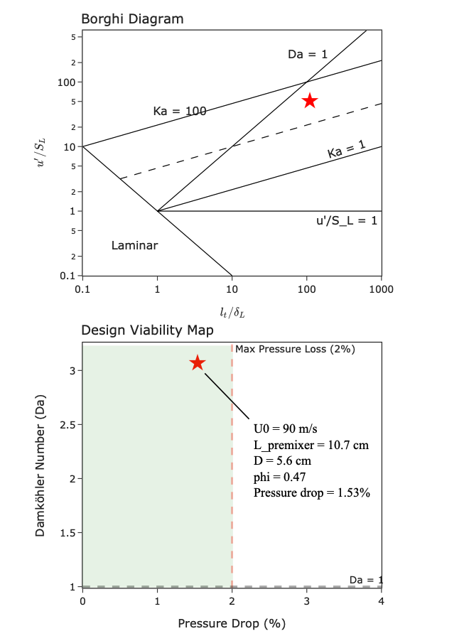

# Combustion Dynamics 2025

Flame stability and mixing optimization for high speed combustion system. 

Program written for course: ```Combustion Dynamics``` ```Fall 2025``` ```McGill University```

[📄 View Full Presentation (PDF)](doc/presentation.pdf)

## Project Overview
This project addresses critical failure modes in a pure methane gas turbine injector. The previous design suffered from flame blow-off ($\Delta P > 2\%$) and poor mixing ($\pm80\%$ equivalence ratio swings). 

Our team redesigned the injector using analytical combustion theory to ensure flame stability, optimal mixing, and adherence to pressure drop constraints.

## Design Objectives
* **Flame Stability:** Prevent blow-off at operating conditions ($U_{bulk} \approx 90$ m/s).
* **Pressure Drop:** Maintain $\Delta P/P_{30} \le 2\%$.
* **Mixing:** Achieve homogeneity with turbulence intensity fluctuations $l < 3\%$.
* **Safety:** Ensure residence time is below autoignition delay ($\tau_{ign}$).

## Methodology
The redesign process utilized a multi-step analytical approach:
1.  **Autoignition Analysis:** Calculated $\tau_{ign}$ (2.05s) using **Cantera** 0-D adiabatic reactors to set safe residence times.
2.  **Turbulence Modeling:** Applied **Pope’s grid turbulence decay correlation** to determine minimum premixer length ($L_{min}$) for required mixing.
3.  **Regime Classification:** Mapped operating points on the **Borghi Diagram** to identify combustion regimes.
4.  **Stabilization Selection:** Compared Jet Flame, Swirl, and Bluff Body mechanisms against the Damköhler number ($Da$) and pressure loss constraints.

## Final Design Specifications
The final design utilizes a **Bluff-Body Stabilized Flame** to decouple the stabilization point from the high-speed mean flow.

| Parameter | Value |
| :--- | :--- |
| **Operating Pressure ($P_{30}$)** | 24 bar |
| **Inlet Temperature ($T_{30}$)** | 750 K |
| **Equivalence Ratio ($\phi$)** | 0.47 |
| **Adiabatic Temp ($T_{ad}$)** | 1793 K |
| **Injector Diameter ($D$)** | 56.15 mm |
| **Premixer Length ($L$)** | 106.74 mm |
| **Blockage Ratio ($BR$)** | 0.25 |
| **Total Pressure Drop** | **1.63%** |

The Borghi diagram placement confirms a stable flame regime with effective mixing.

